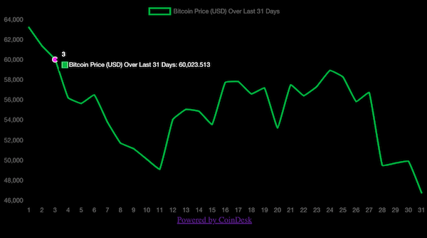

# Bitcoin Price Data Visualizer

App that makes a request to the CoinDesk API and displays Bitcoin price data for the last 31 days. Built with Express, React, Node, & Chart.js.

## Setup:

1. `git clone`
1. install dependencies with `npm install`
1. start server with `npm run start`
1. build bundle with `npm run build`
1. verify app up and running at `localhost:3000`
1. for development, start webpack with `npm run react-dev`